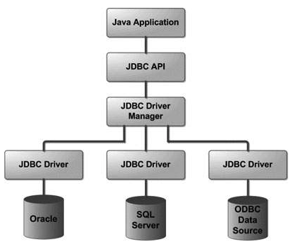

# What is JDBC?
JDBC stands for *Java Database Connectivity* which is a standard Java API for database-independent connectivity 
between the Java programming language and a wide range of databases. Fundamentally, JDBC is a specification that 
provides a complete set of interfaces that allows for portable access to an underlying database.

The JDBC library includes APIs for each of the tasks mentioned below that are commonly associated with database usage.
* Making a connection to a database.
* Creating SQL or MySQL statements.
* Executing SQL or MySQL queries in the database.
* Viewing & Modifying the resulting records.

# Interfaces and Classes of JDBC API
* **DriverManager class** − used to load a SQL driver to connect to database.
* **Connection interface** − used to make a connection to the database using database connection string and credentials.
* **Statement interface** − used to make a query to the database.
* **PreparedStatement interface** − used for a query with placeholder values.
* **CallableStatement interface** − used to called stored procedure or functions in database.
* **ResultSet interface** − represents the query results obtained from the database.
* **ResultSetMetaData interface** − represents the metadata of the result set.
* **BLOB class** − represents binary data stored in BLOB format in database table.
* **CLOB class** − represents text data like XML stored in database table

# JDBC Architecture
The JDBC API supports both two-tier and three-tier processing models for database access but in general, 
JDBC Architecture consists of two layers −
* **JDBC API** − This provides the application-to-JDBC Manager connection.
* **JDBC Driver API** − This supports the JDBC Manager-to-Driver Connection.

The JDBC API uses a driver manager and database-specific drivers to provide transparent connectivity to 
heterogeneous databases.

The JDBC driver manager ensures that the correct driver is used to access each data source. The driver manager is 
capable of supporting multiple concurrent drivers connected to multiple heterogeneous databases.

Following is the architectural diagram, which shows the location of the driver manager with respect to the JDBC 
drivers and the Java application.



# Common JDBC Components
* **DriverManager** − This class manages a list of database drivers. Matches connection requests from the java 
application with the proper database driver using communication sub protocol. 
The first driver that recognizes a certain subprotocol under JDBC will be used to establish a database Connection.

* **Driver** − This interface handles the communications with the database server. You will interact directly 
with Driver objects very rarely. Instead, you use DriverManager objects, which manages objects of this type. 
It also abstracts the details associated with working with Driver objects.

* **Connection** − This interface with all methods for contacting a database. The connection object represents 
communication context, i.e., all communication with database is through connection object only.

* **Statement** − You use objects created from this interface to submit the SQL statements to the database. 
Some derived interfaces accept parameters in addition to executing stored procedures.

* **ResultSet** − These objects hold data retrieved from a database after you execute an SQL query using Statement 
objects. It acts as an iterator to allow you to move through its data.

* **SQLException** − This class handles any errors that occur in a database application.

# Steps in JDBC Application
1. Import the package (java.sql.*)
2. Load and Register the driver. 
3. Establish the connection.
4. Create the Statement
5. Execute the Query.
6. Process Result
7. Close the Connection.

Example Program: [PostgresDatabase.java](src/main/java/org/example/PostgresDatabase.java?plain=1)

# More about Class.forName
When we create a class as below
```java
class ABC {
    static {
        System.out.println("In Static");
    }
    
    //instance code
    {
        System.out.println("In Instance");
    }
}
```
The Class.forName is used to load the class that in turn executes all the static code present in your class
```java
ABC obj = new ABC();
/*
Output:
In Static
In Instance
 */
Class.forName("ABC"); // It will execute only static block
/*
Output:
In Static        
 */
Class.forName("ABC").newInstance(); // It is equivalent to "new ABC()"
/*
Output:
In Static
In Instance
 */
```
So in our case when we use `Class.forName("org.postgresql.Driver")` it is equivalent to below
```java
DriverManager.registerDriver(new org.postgresql.Driver());

//And if we see Driver class implementation we could see below code
public static void register() throws SQLException {
        if (isRegistered()) {
            throw new IllegalStateException("Driver is already registered. It can only be registered once.");
        } else {
            Driver registeredDriver = new Driver();
            DriverManager.registerDriver(registeredDriver);
            Driver.registeredDriver = registeredDriver;
        }
}
```
# JDBC Driver
## What is JDBC Driver?
JDBC drivers implement the defined interfaces in the JDBC API, for interacting with your database server.

For example, using JDBC drivers enable you to open database connections and to interact with it by sending SQL 
or database commands then receiving results with Java.

The Java.sql package that ships with JDK, contains various classes with their behaviours defined and their actual 
implementaions are done in third-party drivers. Third party vendors implements the java.sql.Driver interface in their 
database driver.

## JDBC Drivers Types
JDBC driver implementations vary because of the wide variety of operating systems and hardware platforms in which Java 
operates. Sun has divided the implementation types into four categories, Types 1, 2, 3, and 4, which is explained below.

### Type 1 − JDBC-ODBC Bridge Driver
In a Type 1 driver, a JDBC bridge is used to access ODBC drivers installed on each client machine. Using ODBC, requires 
configuring on your system a Data Source Name (DSN) that represents the target database.

When Java first came out, this was a useful driver because most databases only supported ODBC access but now this type 
of driver is recommended *only for experimental use* or *when no other alternative is available.*


### Type 2 − JDBC-Native API
In a Type 2 driver, JDBC API calls are converted into native C/C++ API calls, which are unique to the database. 
These drivers are typically provided by the database vendors and used in the same manner as the JDBC-ODBC Bridge. 
The vendor-specific driver must be installed on each client machine.

If we change the Database, we have to change the native API, as it is specific to a database and they are mostly 
obsolete now, but you may realize some speed increase with a Type 2 driver, because it eliminates ODBC's overhead.


### Type 3 − Network Protocol driver
In a Type 3 driver, a three-tier approach is used to access databases. The JDBC clients use standard network sockets to 
communicate with a middleware application server. The socket information is then translated by the middleware 
application server into the call format required by the DBMS, and forwarded to the database server.

This kind of driver is extremely flexible, since it requires no code installed on the client and a single driver can 
actually provide access to multiple databases.


You can think of the application server as a JDBC "proxy," meaning that it makes calls for the client application. As a 
result, you need some knowledge of the application server's configuration in order to effectively use this driver type.

Your application server might use a Type 1, 2, or 4 driver to communicate with the database, understanding the nuances 
will prove helpful.

### Type 4 − Thin driver
In a Type 4 driver, a pure Java-based driver communicates directly with the vendor's database through socket connection. 
This is the 
highest performance driver available for the database and is usually provided by the vendor itself.

This kind of driver is extremely flexible, you don't need to install special software on the client or server. Further, 
these drivers can be downloaded dynamically.


## Which Driver should be Used?
* If you are accessing one type of database, such as Oracle, Sybase, or IBM, the preferred driver type is 4.
* If your Java application is accessing multiple types of databases at the same time, type 3 is the preferred driver.
* Type 2 drivers are useful in situations, where a type 3 or type 4 driver is not available yet for your database.
* The type 1 driver is not considered a deployment-level driver, and is typically used for development and testing 
purposes only.

# Closing JDBC Connections
At the end of your JDBC program, it is required explicitly to close all the connections to the database to end 
each database session. However, if you forget, Java's garbage collector will close the connection when it cleans 
up stale objects.

Relying on the garbage collection, especially in database programming, is a very poor programming practice. You 
should make a habit of always closing the connection with the close() method associated with connection object.

To ensure that a connection is closed, you could provide a 'finally' block in your code. A finally block always 
executes, regardless of an exception occurs or not.

```conn.close();```
Explicitly closing a connection conserves DBMS resources, which will make your database administrator happy.

# JDBC - Statements, PreparedStatement and CallableStatement
Once a connection is obtained we can interact with the database. The JDBC Statement, CallableStatement, and 
PreparedStatement interfaces define the methods and properties that enable you to send SQL or PL/SQL commands 
and receive data from your database.

They also define methods that help bridge data type differences between Java and SQL data types used in a database.

The following table provides a summary of each interface's purpose to decide on the interface to use.

| Interfaces        | Recommended Use                                                                                                                                                     |
|-------------------|---------------------------------------------------------------------------------------------------------------------------------------------------------------------|
| Statement         | Use this for general-purpose access to your database. Useful when you are using static SQL statements at runtime. The Statement interface cannot accept parameters. |
| PreparedStatement | Use this when you plan to use the SQL statements many times. The PreparedStatement interface accepts input parameters at runtime.                                   |
| CallableStatement | Use this when you want to access the database stored procedures. The CallableStatement interface can also accept runtime input parameters.                          |

## The Statement Objects
Before you can use a Statement object to execute a SQL statement, you need to create one using the Connection object's 
createStatement( ) method. Once you've created a Statement object, you can then use it to execute an SQL statement with 
one of its three execute methods.

* **boolean execute (String SQL)** - Returns a boolean value of true if a ResultSet object can be retrieved; otherwise, 
it returns false. Use this method to execute SQL DDL statements or when you need to use truly dynamic SQL.

* **int executeUpdate (String SQL)** − Returns the number of rows affected by the execution of the SQL statement. Use 
this method to execute SQL statements for which you expect to get a number of rows affected - for example, an INSERT, 
UPDATE, or DELETE statement.

* **ResultSet executeQuery (String SQL)** − Returns a ResultSet object. Use this method when you expect to get a result 
set, as you would with a SELECT statement.

Example: [PostgresDatabase.java](src/main/java/org/example/PostgresDatabase.java) Method `executeGenericCommand`

### Closing Statement Object
Just as you close a Connection object to save database resources, for the same reason you should also close the 
Statement object.

A simple call to the close() method will do the job. If you close the Connection object first, it will close the 
Statement object as well. However, you should always explicitly close the Statement object to ensure proper cleanup.

## The PreparedStatement Objects
This statement gives you the flexibility of supplying arguments dynamically.

Example: [PostgresDatabase.java](src/main/java/org/example/PostgresDatabase.java) Method `executeCRUDOperations`

# JDBC - Result Sets
The SQL statements that read data from a database query, return the data in a result set. The SELECT statement is the 
standard way to select rows from a database and view them in a result set. The java.sql.ResultSet interface represents 
the result set of a database query.

A ResultSet object maintains a cursor that points to the current row in the result set. The term "result set" refers to 
the row and column data contained in a ResultSet object.

The methods of the ResultSet interface can be broken down into three categories −
* **Navigational methods** − Used to move the cursor around.
* **Get methods** − Used to view the data in the columns of the current row being pointed by the cursor.
* **Update methods** − Used to update the data in the columns of the current row. The updates can then be updated in the 
underlying database as well.

Read more here https://www.tutorialspoint.com/jdbc/jdbc-result-sets.htm

# JDBC - Data Types
Read more here https://www.tutorialspoint.com/jdbc/jdbc-data-types.htm

# JDBC - Transactions
If your JDBC Connection is in auto-commit mode, which it is by default, then every SQL statement is committed to the 
database upon its completion.

That may be fine for simple applications, but there are three reasons why you may want to turn off the auto-commit and 
manage your own transactions
* To increase performance. 
* To maintain the integrity of business processes. 
* To use distributed transactions.

Transactions enable you to control if, and when, changes are applied to the database. It treats a single SQL statement 
or a group of SQL statements as one logical unit, and if any statement fails, the whole transaction fails.

To enable manual- transaction support instead of the auto-commit mode that the JDBC driver uses by default, use the 
Connection object's `setAutoCommit()` method. If you pass a boolean false to setAutoCommit( ), you turn off auto-commit. 
You can pass a boolean true to turn it back on again.

Read more here https://www.tutorialspoint.com/jdbc/jdbc-transactions.htm

# JDBC - Exception Handling
JDBC Exception handling is very similar to the Java Exception handling but for JDBC, the most common exception you'll 
deal with is java.sql.SQLException.
Read more here https://www.tutorialspoint.com/jdbc/jdbc-exceptions.htm

# JDBC - Batch Processing
Batch Processing allows you to group related SQL statements into a batch and submit them with one call to the database.
When you send several SQL statements to the database at once, you reduce the amount of communication overhead, thereby 
improving performance.

Read more here https://www.tutorialspoint.com/jdbc/jdbc-batch-processing.htm

# JDBC - Stored Procedure
Just as a Connection object creates the Statement and PreparedStatement objects, it also creates the CallableStatement 
object, which would be used to execute a call to a database stored procedure.

Read more here https://www.tutorialspoint.com/jdbc/jdbc-stored-procedure.htm

# JDBC - Streaming ASCII and Binary Data
A PreparedStatement object has the ability to use input and output streams to supply parameter data. This enables you 
to place entire files into database columns that can hold large values, such as CLOB and BLOB data types.

There are following methods, which can be used to stream data −
* setAsciiStream() − This method is used to supply large ASCII values. 
* setCharacterStream() − This method is used to supply large UNICODE values. 
* setBinaryStream() − This method is used to supply large binary values.

The `setXXXStream()` method requires an extra parameter, the file size, besides the parameter placeholder. 
This parameter informs the driver how much data should be sent to the database using the stream.

Read more here https://www.tutorialspoint.com/jdbc/jdbc-streaming-data.htm

# JDBC - RowSet
RowSet is an interface, which is like ResultSet, which resides in javax.sql.rowset under java.sql. It inherits 
from ResultSet, and has more capabilities than a ResultSet. RowSets can be scrollable and updatable. Some DBMS 
do not support scrollability and updatability of ResultSets. In that case, RowSets have to be used. Also, 
RowSets have Java Beans functionality. They have properties. Properties can be set or retrieved using setter and 
getter methods. RowSet uses event model, where events are propagated to when certain events occur.

The events are of following three types:
* Update, insert, or deletion of a row
* Cursor movement
* Change in RowSet contents

## Types of RowSet Interfaces
There are 5 major types sub-interfaces of RowSet interface.
* JdbcRowSet
* CachedRowSet
* WebRowSet 
* JoinRowSet 
* FilteredRowSet

Read more here https://www.tutorialspoint.com/jdbc/jdbc-rowset.htm

# JDBC - ACID Properties of Transaction
## What is a Transaction?
A transaction is a single logical unit of operations which accesses and updates the contents of a database.

ACID properties: A for Atomicity, C for Consistency, I for Isolation, D for Durability.

## Dirty Read, Non-repeatable read, Phantom Read
* **Dirty Read** − User A inserts a row into table. User B selects the row. User A cancels the transaction. Now, B has 
made changes to the row, but that row is not in the database anymore.

* **Non-repeatable read** − User A reads a row. User B updates the row. User A reads the row again, and sees the updated 
result.

* **Phantom read** − User A reads all rows in a table that satisfies a WHERE condition in SQL. User B adds a row to the 
same query satisfying a WHERE condition. User A does a SELECT again and finds the added row.

## Isolation Levels
| Sr.No. | 	Isolation Level             | Description                                                                                                                                                               |
|--------|------------------------------|---------------------------------------------------------------------------------------------------------------------------------------------------------------------------|
| 1      | TRANSACTION_NONE             | Transaction is not supported.                                                                                                                                             |
| 2      | TRANSACTION_READ_UNCOMMITTED | Unsaved data is visible to transaction. All data inconsistencies are possible.                                                                                            |
| 3      | TRANSACTION_READ_COMMITTED   | 	Prevents dirty read. All changes to a transaction are visible only after the transaction is committed.                                                                   | 
| 4      | TRANSACTION_REPEATABLE_READ  | 	Prevents dirty read, non-repeatable read. A second transaction cannot read, update or delete the rows selected by the first transaction. Does not prevent phantom reads. |
| 5      | TRANSACTION_SERIALIZABLE     | Strictest isolation level. Prevents dirty read, non-repeatable read, phantom read.                                                                                        |

The above isolation levels can be set in the Connection object in the java.sql package, by the setIsolationLevel method. 
For example,
```java
Connection conn = DriverManager.getConnection("jdbc:mysql://localhost/TUTORIALSPOINT", "user", "password");
conn.setIsolationLevel(Connection.TRANSACTION_READ_COMMITTED);
```
Setting Isolation Level in MySQL
Isolation level can also be set in the database. For MySQL −

```sql
mysql> SET TRANSACTION ISOLATION LEVEL SERIALIZABLE;
```
# JDBC - Connection Pooling
For web sites with high traffic, resources to acquire a database connection can be expensive. Also, imagine a situation 
where there are 500 concurrent users of a web site and each is trying to get hold of a connection to select or update 
data. In this scenario, to prevent multiple users to corrupt the data, the database has locks. When a user does a select 
on a table, the table is locked. No other user can get hold of the table unless the lock is freed. For 500 users to wait 
for a connection is not acceptable.

Connection pooling in Java is a technique used to improve the performance of database-driven applications. Instead of 
creating a new connection every time the application needs to interact with the database, a pool of connections is 
created and managed by a connection pool manager. This eliminates the overhead of establishing a new connection each 
time, resulting in faster response times and better resource utilization

## Advantages of connection pooling
Following are the advantages of the connection pooling.
* **Improved performance** − Connection pooling reduces the overhead of creating and closing connections, resulting in 
faster response times for your application.

* **Resource optimization** − By reusing connections, connection pooling helps to conserve system resources, such as 
memory and network connections.

* **Scalability − Connection** pools can be configured to grow or shrink dynamically based on demand, allowing your 
application to handle varying workloads.

## Popular Connection Pooling Libraries
* **HikariCP** − Known for its performance and efficiency.
* **Apache Commons DBCP** − Widely used and well-established.
* **c3p0** − Another popular option with a focus on stability.


