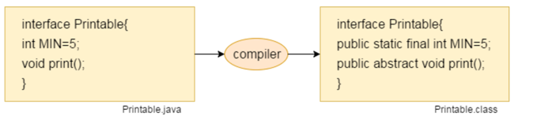
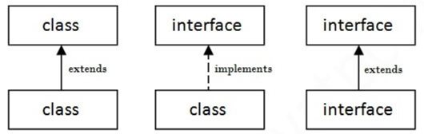

# Interface
An interface is a fully abstract class. It includes a group of abstract methods (methods without a body) and static 
constants. An interface in Java is a blueprint of a class.

Like abstract classes, we cannot create objects of interfaces. To use an interface, other classes must implement it. 
We use the implements keyword to implement an interface.

**All the fields are public, static and final by default**. A class that implements an interface must implement 
all the methods declared in the interface.

We use the interface keyword to create an `interface` in Java. For example,

```java
interface Printable {
    int MIN=5;
    void print();
}
```


Java Interface also represents the **IS-A** relationship.

# Default methods in Interface
With the release of Java 8, we can now add methods with implementation inside an interface. These methods are 
called default methods.

```java
public default void getSides() {
   // body of getSides()
}
```

## Why default methods?
Suppose, we need to add a new method in an interface.

We can add the method in our interface easily without implementation. However, that's not the end of the story. 
All our classes that implement that interface must provide an implementation for the method.

If a large number of classes were implementing this interface, we need to track all these classes and make changes to 
them. This is not only tedious but error-prone as well.

# private and static Methods in Interface
The Java 8 also added another feature to include static methods inside an interface. Similar to a class, we can access 
static methods of an interface using its references. For example,
```java
// create an interface
interface Polygon {
  staticMethod(){..}
}

// access static method
Polygon.staticMethod();
```
**_Note:_** With the release of Java 9, private methods are also supported in interfaces. We cannot create objects of 
an interface. Hence, private methods are used as helper methods that provide support to other methods in interfaces.

# The relationship between classes and interfaces
As shown in the figure given below, a class extends another class, an interface extends another interface, but a class 
implements an interface.


# Implementing Multiple Interfaces
```java
interface A {
  // members of A
}

interface B {
  // members of B
}

class C implements A, B {
  // abstract members of A
  // abstract members of B
}
```

# Extending an Interface
```java
interface Line {
  // members of Line interface
}

// extending interface
interface Polygon extends Line {
  // members of Polygon interface
  // members of Line interface
}
```

# Extending Multiple Interfaces
```java
interface A {
   ...
}
interface B {
   ... 
}

interface C extends A, B {
   ...
}
```

# Multiple inheritance is not supported through class in java, but it is possible by an interface, why?
multiple inheritance is not supported in the case of class because of ambiguity. However, it is supported in case of 
an interface because there is no ambiguity. It is because its implementation is provided by the implementation class.

# What is marker or tagged interface?
An interface which has no member is known as a marker or tagged interface, for example, Serializable, Cloneable, 
Remote, etc. They are used to provide some essential information to the JVM so that JVM may perform some useful 
operation.

# Nested Interface in Java
An interface, i.e., declared within another interface or class, is known as a nested interface. The nested interfaces 
are used to group related interfaces so that they can be easy to maintain. The nested interface must be referred to by 
the outer interface or class. It can't be accessed directly.

## Points to remember for nested interfaces
* The nested interface must be public if it is declared inside the interface, but it can have any access modifier if 
declared within the class.
* Nested interfaces are declared static

## Example of nested interface which is declared within the interface
```java
interface Showable{  
  void show();  
  interface Message{  
   void msg();  
  }  
}  
class TestNestedInterface1 implements Showable.Message{  
 public void msg(){System.out.println("Hello nested interface");}  
  
 public static void main(String args[]){  
  Showable.Message message=new TestNestedInterface1();//upcasting here  
  message.msg();  
 }  
}  
```

## Example of nested interface which is declared within the class
```java
class A{  
  interface Message{  
   void msg();  
  }  
}  
  
class TestNestedInterface2 implements A.Message{  
 public void msg(){System.out.println("Hello nested interface");}  
  
 public static void main(String args[]){  
  A.Message message=new TestNestedInterface2();//upcasting here  
  message.msg();  
 }  
}  
```

## Can we define a class inside the interface?
Yes, if we define a class inside the interface, the Java compiler creates a static nested class. Let's see how can we 
define a class within the interface:
```java
interface M{  
  class A{}  
}
```
Practice code for this topic: [InterfaceExample.java](../src/main/java/org/example/InterfaceExample.java)