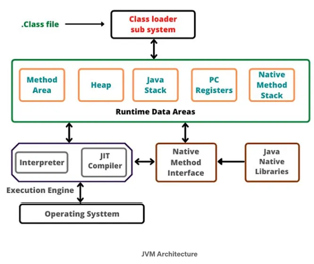
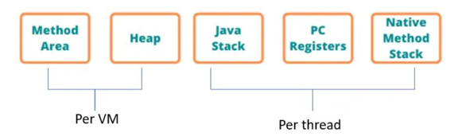
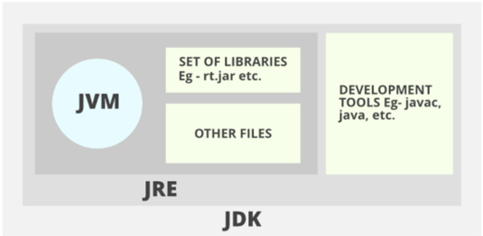

# JDK, JVM and JRE
## How JVM Works
JVM(Java Virtual Machine) acts as a **run-time engine to run Java applications**. JVM is the one that actually calls the 
main method present in a java code. JVM is a part of JRE(Java Runtime Environment).

Java applications are called **WORA** (Write Once Run Anywhere). It is possible because of JVM.

When we compile a `.java` file, `.class` files(contains byte-code) with the same class names present in `.java` file 
are generated by the Java compiler. This `.class` file goes into various steps when we run it.

A JVM instance is created each time you run a Java application. It is in charge of the bytecode to machine code 
conversion process. It will create **one JVM instance per Java program** if you execute multiple Java programs.

## Architecture of JVM
**The architecture of JVM mainly consists of 3 components:**
1. class Loader
2. Runtime Memory/Data Areas
3. Execution Engine.



### I. class Loader
ClassLoader performs 3 main tasks. They are Loading, Linking, and Initialization.

#### 1. Loading
Before the loading process, the class loader reads the following things of a class that is supposed to be loaded. 
Fully qualified name, variable information, Immediate parent, Checks whether it is a class, interface, or an enum. 
After reading the above items, the class is loaded to the Method Ares of memory.

After loading the “.class” file, JVM creates an object of type Class to **represent this file in the heap memory**. 
Please note that this object is of type Class predefined in `java.lang package`. These Class object can be used by the 
programmer for getting class level information like the name of the class, parent name, methods and variable information 
etc. To get this object reference we can use getClass() method of Object class.

```java
Student s1 = new Student();
//Getting hold of Class object created by JVM.
Class c1 = s1.getClass();
// Note: For every loaded “.class” file, only one object of the class is created.
Student s2 = new Student();
Class c2 = s2.getClass();
System.out.println(c1==c2); // output will be true
```
**There are 3 Class Loaders:**
1. **Bootstrap class loader:** Every JVM implementation must have a bootstrap class loader, capable of loading trusted 
classes. It loads core java API classes present in the “JAVA_HOME/jre/lib” directory. This path is popularly known as 
the bootstrap path. It is implemented in native languages like C, C++.
2. **Extension class loader:** It is a child of the bootstrap class loader. It loads the classes present in the 
extensions directories “JAVA_HOME/jre/lib/ext”(Extension path) or any other directory specified by the java.ext.dirs 
system property.
3. **System/Application class loader:** It is a child of the extension class loader. It is responsible to load classes 
from the application classpath. It internally uses Environment Variable which mapped to java.class.path.

_**Note**_: JVM follows the **Delegation-Hierarchy principle to load classes**. System class loader delegate load 
request to extension class loader and extension class loader delegate request to the bootstrap class loader. If a 
class found in the boot-strap path, the class is loaded otherwise request again transfers to the extension class loader 
and then to the system class loader. At last, if the system class loader fails to load class, 
then we **get run-time exception** `java.lang.ClassNotFoundException`. 

#### 2. Linking
**This process can be divided into three main parts.**
* **Verification**: It ensures the correctness of the `.class` file i.e. it checks whether this file is properly formatted 
and generated by a valid compiler or not.If verification fails, we get run-time exception `java.lang.VerifyError`. 
This activity is done by the component **ByteCodeVerifier**. Once this activity is completed then the class file is 
ready for compilation.

* **Preparation:**  JVM allocates memory for class static variables and initializes the memory to **default values.**

* **Resolution:** It is the process of replacing symbolic references from the type with direct references.

#### 3.Initialization
This process will assign real values to variables that were previously assigned default values in the Linking process’s 
preparation step. Furthermore, if any static blocks exist, they will be executed. The JVM requires implementations to 
perform initializations before each class is utilized. 
This is executed from top to bottom in a class and from **parent to child** in the class hierarchy.

### II.  Runtime Memory /Data area
This Memory area is divided into 5 categories. They are Method area, Heap, Java stack, Pc registers, and Negative 
Method stack.
1. **Method area:** In the method area, all class level information like class name, immediate parent class name, 
methods and variables information etc. are stored, including static variables. There is **only one method area per JVM**, 
and it is a shared resource. **From java 8, static variables are now stored in Heap area**.
2. **Heap area:** All the objects are stored in the heap area. There is also **one Heap Area per JVM**. 
_It is also a shared resource_.
3. **Stack area:** For every thread, JVM creates one run-time stack which is stored here. Every block of this stack is 
called activation record/stack frame which stores methods calls. All local variables of that method are stored in 
their corresponding frame. After a thread terminates, its run-time stack will be destroyed by JVM. 
**It is not a shared resource.**
4. **PC Registers:** Store address of current execution instruction of a thread. Obviously, each thread has separate 
PC Registers.
5. **Native method stacks:** For every thread, a separate native stack is created. When native methods are accessing 
this area, It holds native information/methods.



### III. Execution Engine
Execution engine executes the `.class` (bytecode). It reads the byte-code line by line, uses data and information 
present in various memory areas and executes instructions.

**The Execution Engine is made up of three parts.**
1. **Interpreter:** It interprets the bytecode line by line and then executes. The disadvantage here is that when one 
method is called multiple times, every time interpretation is required.
2. **Just-In-Time Compiler:** It is used to increase the efficiency of an interpreter. It compiles the entire bytecode 
and changes it to native code so whenever the interpreter sees repeated method calls, JIT provides direct native code 
for that part so re-interpretation is not required, thus efficiency is improved.
3. **Garbage Collector:** This checks the heap region for any unreferenced objects and destroys them to free up memory. 
As a result, it makes room for more items.

# Differences between JDK, JRE and JVM


# Difference between Byte Code and Machine Code
Byte code is an **intermediate code between the source code and machine code**. It is a low-level code that is the result 
of the compilation of a source code which is written in a high-level language. It is processed by a virtual machine 
like Java Virtual Machine (JVM).

Byte code is a **non-runnable code** after it is translated by an interpreter into machine code then it is 
understandable by the machine. It is compiled to run on JVM, any system having JVM can run it irrespective of their 
operating system. **That’s why Java is platform-independent. Byte code is referred to as a Portable code.**

Machine code is a set of instructions that is directly machine-understandable and it is processed by the Central 
Processing Unit (CPU). Machine code is in binary (0’s and 1’s) format which is completely different from the byte code 
and source code. It is regarded as the lowest-level representation of the source code. Machine code is obtained after 
compilation or interpretation. It is also called machine language.


