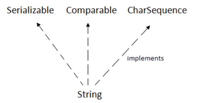
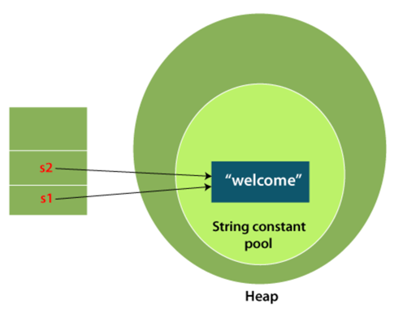

# Data types in Java
Data types specify the different sizes and values that can be stored in the variable. There are two types of data types 
in Java:
* **Primitive data types:** The primitive data types include boolean, char, byte, short, int, long, float and double.
* **Non-primitive data types:** The non-primitive data types include Classes, Interfaces, and Arrays.

## Java Primitive Data Types
In Java, there are mainly eight primitive data types

| Data Type | Default Value | Default size |
|-----------|---------------|--------------|
| boolean   | false         | 1 bit        |
| char      | '\u0000'      | 2 byte (IMP) |
| byte      | 0             | 1 byte       |
| short     | 0             | 2 byte       |
| int       | 0             | 4 byte       |
| long      | 0L            | 8 byte       |
| float     | 0.0f          | 4 byte       |
| double    | 0.0d          | 8 byte       |

Check Program [SyntaxAndDataType](../src/main/java/org/example/SyntaxAndDataType.java) Method `primitiveDataTypes`

## Non primitive Data Type in Java
In Java, non-primitive data types, also known as **reference data types**, are used to store complex objects rather than 
simple values. Unlike primitive data types that store the actual values, reference data types store references or 
memory addresses that point to the location of the object in memory. This distinction is important because it affects 
how these data types are stored, passed, and manipulated in Java programs.

1. class : One common non-primitive data type in Java is the class. Classes are used to create objects, which are 
instances of the class. A class defines the properties and behaviors of objects, including variables (fields) and 
methods. For example, you might create a Person class to represent a classExample, with variables for the classExample's name,
age, and address, and methods to set and get these values.
2. Interface :  An interface defines a contract for what a class implementing the interface must provide, without 
specifying how it should be implemented. Interfaces are used to achieve abstraction and multiple inheritance in Java, 
allowing classes to be more flexible and reusable.
3. Arrays/List etc
4. Enum: Enums are used to define a set of named constants, providing a way to represent a fixed set of values.

Check Program [SyntaxAndDataType](../src/main/java/org/example/SyntaxAndDataType.java) Method `nonPrimitiveDataTypes`

### Why char uses 2 byte in Java and what is \u0000?
It is because Java uses Unicode system not ASCII code system. The \u0000 is the lowest range of Unicode system.

# Wrapper Classes
A Wrapper class in Java is a class whose object wraps or contains primitive data types. When we create an object to a 
wrapper class, it contains a field and in this field, we can store primitive data types.

## Need of Wrapper Classes
* They convert primitive data types into objects. Objects are needed if we wish to modify the arguments passed into a 
method (because primitive types are passed by value).
* The classes in java.util package handles only objects and hence wrapper classes help in this case also.
* Data structures in the Collection framework, such as ArrayList and Vector, store only objects (reference types) and 
not primitive types.

## Autoboxing
The automatic conversion of primitive types to the object of their corresponding wrapper classes is known as autoboxing. 
For example – conversion of int to Integer, long to Long, double to Double, etc.
## Unboxing
It is just the reverse process of autoboxing. Automatically converting an object of a wrapper class to its corresponding 
primitive type is known as unboxing. For example – conversion of Integer to int, Long to long, Double to double, etc.

# Conditional statements in Java
**Java has the following conditional statements:**
* Use `if` to specify a block of code to be executed, if a specified condition is true
* Use `else` to specify a block of code to be executed, if the same condition is false
* Use `else if` to specify a new condition to test, if the first condition is false
* Use `switch` to specify many alternative blocks of code to be executed

Practice code: [SyntaxAndDataType](../src/main/java/org/example/SyntaxAndDataType.java) Method `conditional_statements`

# Loops in Java
**while loop:**
Syntax:
```java
while(boolean_condition){
    // statements ...
    }
```

**For loop:**
```java
for (initialization condition; testing condition;increment/decrement){
    statement(s)
}
```

# Strings in Java
In Java, string is basically an object that represents sequence of char values. An array of characters works same as 
Java string. For example:

```java
char[] ch={'j','a','v','a'};  
String s=new String(ch);

// is same as
String s="java";
```
`String` class provides a lot of methods to perform operations on strings such as c`ompare(), concat(), equals(), 
split(), length(), replace(), compareTo(), intern(), substring()` etc.

The `java.lang.String` class implements `Serializable`, `Comparable` and `CharSequence` interfaces.


## CharSequence Interface
Java's CharSequence interface provides a unified, read-only view of character sequences and is a component of the 
`java.lang package`. It facilitates consistent access and manipulation across various types of character sequences, 
including String, StringBuilder, StringBuffer, and CharBuffer. Through this interface, key functionalities for 
handling character data are defined, enabling actions like measuring sequence length, accessing particular characters, 
generating character subsequences, and transforming into a String format. By providing a common blueprint for 
character sequences, `CharSequence` enables flexible and implementation-independent text processing across the 
Java platform.

`String`, `StringBuffer` and `StringBuilder` classes implement it. It means, we can create strings in Java by 
using these three classes.

_**Important:**_ The **Java String is immutable** which means it cannot be changed. Whenever we change any string, 
a new instance is created. For mutable strings, you can use `StringBuffer` and `StringBuilder` classes.

## Serializable
Allows string objects to be serialized into byte streams, facilitating their transmission or storage.

## Comparable
Enables lexical comparison between two strings, supporting natural ordering within collections.

## What is String in Java?
Generally, String is a sequence of characters. But in Java, string is an object that represents a sequence of characters. 
The `java.lang.String` class is used to create a string object.

## How to create a string object?
There are two ways to create String object:
1. By string literal
```java
String s="welcome";
```
Each time you create a string literal, the JVM checks the "string constant pool" first. If the string already exists in 
the pool, a reference to the pooled instance is returned. If the string doesn't exist in the pool, a new string instance 
is created and placed in the pool. For example:

```java
String s1="Welcome";  
String s2="Welcome";//It doesn't create a new instance  
```


### Why Java uses the concept of String literal?
To make Java more memory efficient (because no new objects are created if it exists already in the string constant pool).

2. By new keyword
```java
String s=new String("Welcome");//creates two objects and one reference variable
```
In such case, JVM will create a new string object in normal (non-pool) heap memory, and the literal "Welcome" will be 
placed in the string constant pool. The variable s will refer to the object in a heap (non-pool).

### Memory Allotment of String
**String Literal Storage:** When you create a string using string literals, Java checks the string pool first. The new 
variable points to the existing string if it already exists. If it doesn't exist, the new string is added to the Pool, 
and the variable points to this new string.

**new Keyword and String Pool:** Strings created with the new operator **do not use the Pool by default**. They are 
**stored in the heap memory outside the Pool**, which means each new operation results in a new object, even if it 
contains the same string data.

**Interning:** We can manually add a string to the Pool or ensure it uses the Pool by calling the intern() method 
on a string object. If the Pool already contains an equal string, the string from the Pool is returned. Otherwise, 
the string is added to the Pool.
```java
String s4 = new String("Hello").intern(); // Ensures use of the string pool
```


Check Program [SyntaxAndDataType](../src/main/java/org/example/SyntaxAndDataType.java) Method `stringsInJava`

# StringBuffer
StringBuffer represents a mutable sequence of characters that ensures thread safety, making it suitable for scenarios 
involving multiple threads that modify a character sequence. It includes various string manipulation capabilities, 
including the ability to insert, delete, and append characters. This design avoids the necessity of generating new 
objects with each change, leading to enhanced efficiency in situations requiring regular adjustments to the 
string content.

Syntax:
```java
StringBuffer sb = new StringBuffer();
```
Check Program [SyntaxAndDataType](../src/main/java/org/example/SyntaxAndDataType.java) Method `StringBufferExample`

## Note
`String buffer` is Thread-safe whereas `StringBuilder` class provides no guarantee of synchronization. Also StingBuilder 
is high in performance compared to String buffer.


